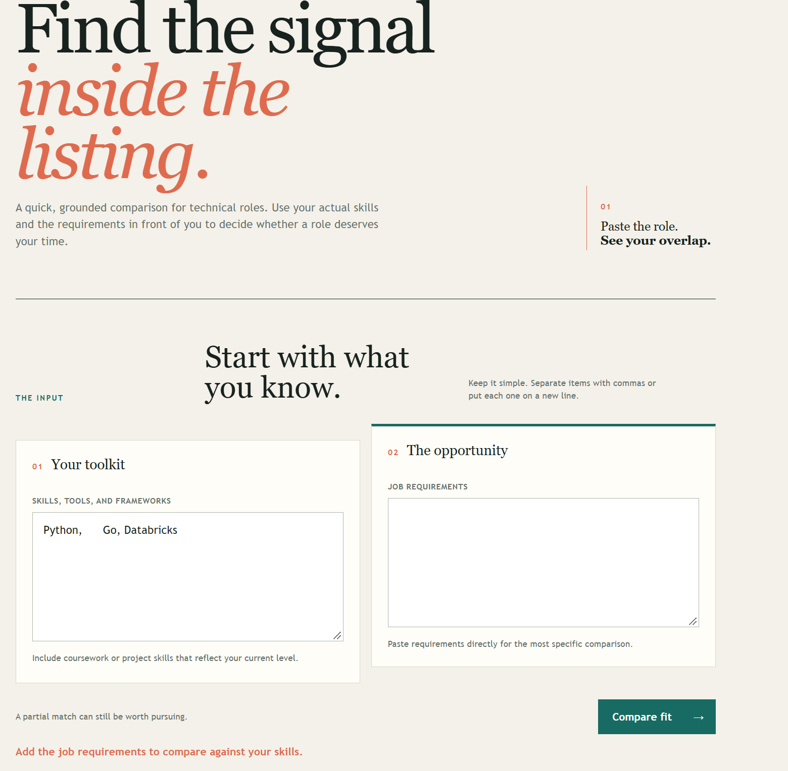
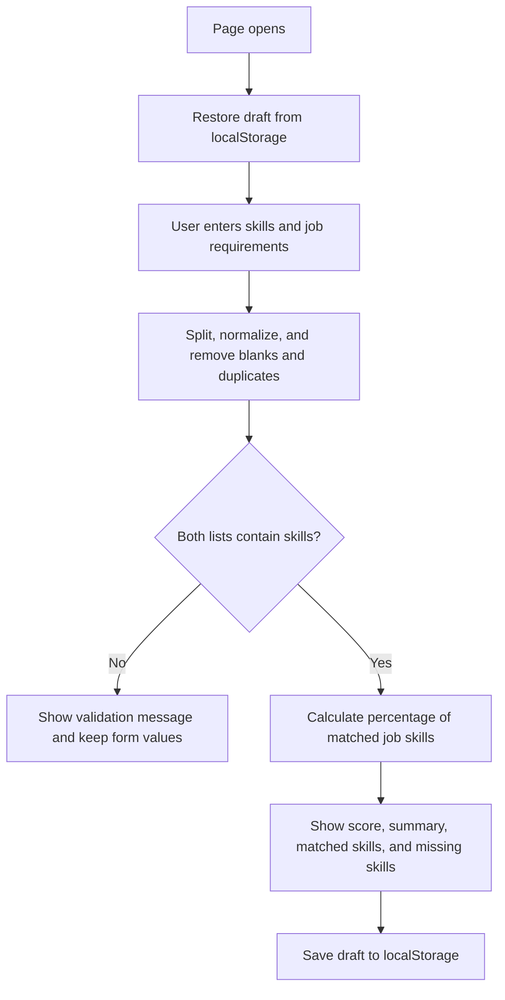

# Job Skill Comparision Application

<!-- Badges are optional but cheap. shields.io generates them from a URL. -->


## What

The Job Skill Comparision Application helps technical job seekers decide whether a role is worth pursuing by comparing their skills with a job's requirements. It reports a percentage alignment score, shows matched and missing skills, and presents the result as a suggestion rather than a guarantee of an interview or job offer. See the project context in [PROJECT.md](context/PROJECT.md) and the feature requirements in [FEATURES.md](context/FEATURES.md).

## See It Work

This screenshot shows the app meeting the empty-input EARS requirement: when either list is empty after trimming and removing blanks, the page displays a validation message and does not compute a match score. This behavior is verified in the acceptance checks and is described in the Explain, Change, Verify section at the bottom th page which describes the function which generates the percentage match.



<!-- HTML gives you sizing control markdown does not: -->
<!--  -->

## How to Run

Open this repository in a GitHub Codespace. No local install is required.

1. On your repository page, click **Code → Codespaces → Create codespace on main**. Wait for setup to finish; first-boot time varies.
2. Keep the supplied `.devcontainer/devcontainer.json`. It configures Live Server installation and port 5500 forwarding. Once the extension is ready, right-click `index.html` and choose **Open with Live Server**, or use **Go Live**.
3. If a browser tab does not open, use the **Ports** tab to open port 5500. Keep its visibility **Private**.
4. With Live Server running, save your edits to reload the page.

If Live Server is unavailable, run `node scripts/serve.mjs` in the terminal, then open port 5500 from the Ports tab. Refresh the browser after edits when using this fallback; stop it with **Ctrl+C**. Run only one server on port 5500 at a time. The fallback also works locally with Node 22 or later. Serve over HTTP rather than opening `index.html` through `file://`.

<!-- The .devcontainer folder installs Live Server automatically. If the right-click option
     is missing, wait for the extension to finish installing (bottom-left status bar), or run
     `python3 -m http.server 5500` in the terminal and open port 5500 from the Ports tab.
     Edit these steps if your feature needs anything more. -->

## How It Works

<!-- GitHub renders Mermaid natively inside a ```mermaid fence. -->



The application reads saved drafts, accepts comma- or line-separated skills, normalizes common aliases, and ignores blank or duplicate entries. It compares each unique job requirement with the user's skills, calculates the percentage match, and renders separate matched and missing lists. Input validation and storage error messages preserve the user's typed values.

## Status

| Area | State | Why |
|------|-------|-----|
| Save and display | Works | The [unit tests](app.test.js) verify that a percentage match is displayed. |
| Invalid input | Not tested | Kept simple for now; dedicated invalid-input testing will be added in the future. |
| Data survives reload / storage failure | Partial | [EARS 8](app.test.js) verifies that the saved skill lists return after a page reload, and the behavior was manually checked; other cases of storage-failure handling has not been implemented. |
| Multi-user sync (starter limitation) | Deferred | Browser-local storage does not provide sync.


<details>
<summary>Verification results (click to expand)</summary>

The automated suite passed all 8 EARS tests, covering comparison percentages, empty input validation, fit thresholds, matched and missing lists, normalization, and reload persistence. See the [full Verification results](context/FEATURES.md#verification) for the procedures and observed outcomes. Storage-failure handling is not implemented.

</details>

## Links

Read in this order:

0. [`SCAFFOLD_MANIFEST.md`](SCAFFOLD_MANIFEST.md): explains what carries over from HW2 into HW3, along with a submission checklist
1. [`context/PROJECT.md`](context/PROJECT.md): the problem and its framing
2. [`context/USERS.md`](context/USERS.md): who this is for
3. [`context/FEATURES.md`](context/FEATURES.md): what it must do, and verification results
4. [`context/ARCHITECTURE.md`](context/ARCHITECTURE.md): the gate and ADR-001
5. [`context/STANDARDS.md`](context/STANDARDS.md): the rules this code follows
6. [`context/CLAUDE.md`](context/CLAUDE.md): the same rules, for agents
7. [`index.html`](index.html): the page structure and form controls
8. [`styles.css`](styles.css): the page styling and layout
9. [`app.js`](app.js): comparison, validation, rendering, and storage logic
10. [`app.test.js`](app.test.js): automated behavior tests
11. [`manifest.json`](manifest.json): application metadata

The scaffold has **eleven canonical files in `/context`: six active files above and five previews**: [STYLE.md](context/STYLE.md), [TOOLS.md](context/TOOLS.md), [SKILLS.md](context/SKILLS.md), [EVALS.md](context/EVALS.md), and [AGENTS.md](context/AGENTS.md). Keep the previews; verification stays in FEATURES.md until EVALS.md activates in Module 5.

Root README.md and the two instruction adapters—[CLAUDE.md](CLAUDE.md) and [.github/copilot-instructions.md](.github/copilot-instructions.md)—are additional files. Copy your HW2 USERS.md and FEATURES.md into `/context` and revise them using instructor feedback if available; otherwise record a peer criterion check and mark instructor feedback pending. Run `node scripts/check-scaffold.mjs` to check required file presence; this does not assess content quality.

## AI Use

<!-- A Delegation Decision Record without the name. From HW5 this becomes a formal DDR. -->

**Tool and task delegated:** Creation of app.js and associated unit tests to cover EARS evidence, index.html, styles.css and generation of parts of README.md, CLAUDE.md. For other files it was used to polish writing after my drafts.

**Why:** Creating the app by hand and testing it would have taken a lot of time (estimating a month).  Generating the How it works, what it does sections of the README makes sense since AI could use app.js, index.html, styles.css and context files to easily generate this information.

**How it was checked:** Manually checked code to see whether instances of innerHTML was used(which it did not). After AI generated the app I made edits to increase font size for validation message, edit and remove pre-written text, and remove dead code not used.

**Observed result / evidence:** The change history records the following feature work and checks:

- [Verification results](context/FEATURES.md#verification).
- [Validation message styling](styles.css) was checked with the empty-input EARS test and manual visual review; commit `2aaca8f5e1c87582b1a9f2192e602c61e8d93e57` records the increase in message size.
- [Prefilled input removal](index.html) was manually checked by confirming both fields open blank; commit `a964338c9c967bd91fea72a4bbff6ebf5f451067` records the removal.
- [No skill match despite 100% display fix](https://github.com/aaronsarasota04/mgt3745-hw3/commit/9d3f2e24f8877f557100ac5fbced39801850e113) was checked by the exact-match EARS test.
- [LinkedIn link removal](https://github.com/aaronsarasota04/mgt3745-hw3/commit/2f78fff6e6fbebf672bb16df2d56da04018ebe40) and [role profile removal](https://github.com/aaronsarasota04/mgt3745-hw3/commit/6878148e9c2a01342d2225e96fbe80a71584a5a9) were manually reviewed as scope reductions; the current unit suite checks that the remaining comparison workflow still passes.

**Instruction discovery and compliance:** Github Copilot. It read instructions from CLAUDE.md. All standards in CLAUDE.md has been ensured it is present in the code


**Actual hours on this assignment (optional):** 6

## Explain, Change, Verify

[Identify one function and explain its input, state changes, and output in your own words. Link a meaningful before/after code change, state its expected effect, and record the observed behavior and evidence. Explain why the change matters to your selected requirement. This paragraph is part of the existing README submission.]

The function evaluateMatch does not take in any input. It extracts the skills input by the user for themselves and for the job they are trying to compare it with into two lists (these are saved as constants) . If any of these lists are null, then it prints a validation message, depending on which list is null. It then filters out matched skills, missing skills, and calculates a percentage of skills matched. If the percentage is more than 75%, a message saying it is a strong fit is recorded; if it is between 50 and 75%, it is a partial fit, otherwise it is a weak fit. All of these constants are then output to show on the webpage. This function is crucial to the webpage, since it handles the main logic on how two lists are converted to a percentage the user can then use to decide whether to pursue that job or not.

### Before and after the code change

Before the change, the app did not do anything once Compare fit is clicked. The logic when this is clicked is controlled by evaluateMatch which can be seen in the second photo below. 


<!-- Things this README could also do, if they earn their place:
     - GitHub alerts:  > [!NOTE]  > [!WARNING]  > [!TIP]
     - Task lists:     - [x] done   - [ ] not yet
     - Emoji:          :rocket: :white_check_mark:
     - Footnotes:      text[^1]  ...  [^1]: the note
     - Embedded HTML tables, <kbd>Ctrl</kbd>+<kbd>S</kbd>, <sup>, <sub>
     None are required. A README that reads well with none of them beats one that uses all of them. -->
